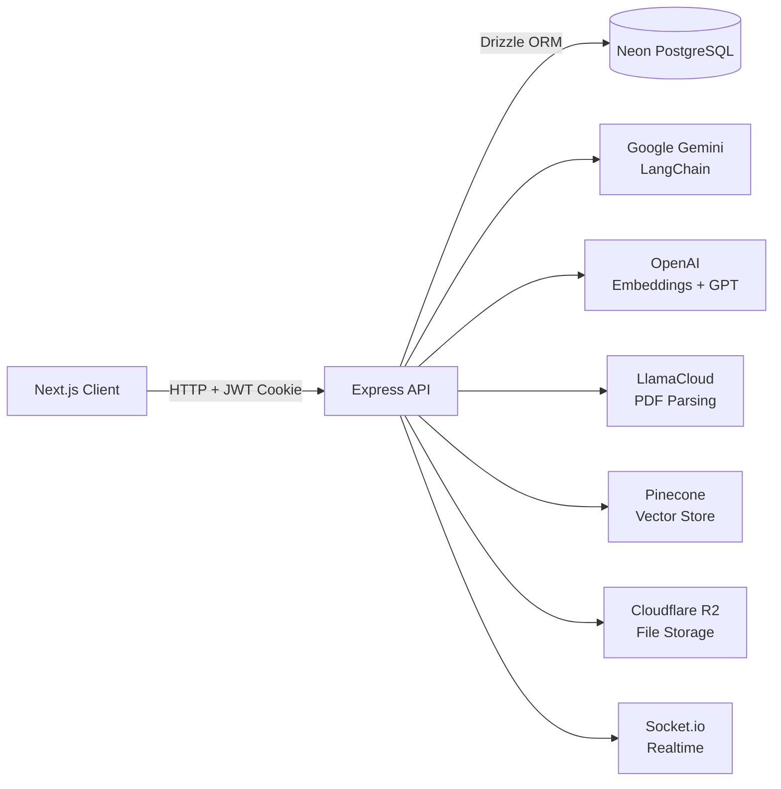

# CourseWise — AI-Powered Study Assistant

A full-stack monorepo thesis prototype combining course management, multiple AI study assistants, an exam engine, and personalized learning workflows.


---

## Overview

CourseWise is a student-facing learning platform that integrates multiple AI providers into a single cohesive study environment. It lets students organise their courses, upload study materials, get AI-assisted explanations, practise with auto-generated exams, and receive personalised study plans — all from one dashboard.

This repository is **Prototype 2** of the thesis project, consolidating all feature modules into a single deployable application.

---

## Monorepo Structure

```text
p-2-all-prototypes/
├── client/     # Next.js 16 frontend (App Router)
├── server/     # Express 4 + TypeScript REST API
├── AGENTS.md   # Coding standards & architecture guide
└── README.md
```

---

## Features

### Course & Content Management
- Create courses with descriptions; organise them into topics with ordered indices
- Upload study materials (PDFs and documents) per topic; files stored in R2-compatible object storage
- Materials are auto-parsed and chunked for RAG-based retrieval via LlamaCloud + Pinecone

### AI Text Assistant (RAG Chat)
- Per-course AI chat that answers questions grounded in uploaded materials
- Full chat history persisted per session; streaming-ready architecture

### Math Assistant
- Powered by **Google Gemini** (`gemini-3-flash-preview`) via LangChain
- Returns structured step-by-step solutions with LaTeX-formatted math rendered client-side via **KaTeX**
- Automatically generates **Mermaid diagrams** when a visualisation is requested
- Integrated web search for additional references; sources persisted alongside messages

### Research Assistant
- Upload academic PDF papers; parsed via **LlamaCloud** and embedded with **OpenAI `text-embedding-3-large`**
- Vectors stored in **Pinecone**; queries use semantic RAG retrieval with cited source passages
- Papers and their chunk metadata stored in PostgreSQL for reuse across sessions

### Exam Engine
- **Exam Patterns**: Configure question-type distribution (MCQ, short-answer, etc.) and difficulty levels
- **Generated Exams**: AI auto-generates complete exams from course materials matching a chosen pattern
- **Exam Sessions**: Timed, interactive exam-taking interface with live answer tracking
- **Exam Results**: Scored results with per-question feedback; full history per course

### Personalised Study Paths
- AI generates a structured study plan from course topics and uploaded materials
- Output includes prioritised tasks (high/medium/low), time estimates, due dates, and strategic insights

### Performance Analytics
- Topic-level accuracy breakdown with bar charts (Recharts)
- Quiz history trend tracking
- AI-driven recommendations highlighting weak areas and suggesting revision actions

### Bilingual Voice Assistant (Prototype)
- Supports both **Bangla** and **English** voice queries
- Language toggle with voice-to-text input and text-to-speech response playback

### Other
- Dark/light mode via CSS variables and `next-themes`
- PYQ (Previous Year Questions) analysis view
- Book/material library browser
- Profile and security settings (password, email)
- Real-time socket channel (Socket.io) scaffolded for future collaborative features

---

## System Architecture



---

## Tech Stack

### Frontend (`client/`)

| Concern | Library |
|---|---|
| Framework | Next.js 16 (App Router) + React 19 |
| Language | TypeScript 5 (strict) |
| Styling | Tailwind CSS 4 + Radix UI primitives |
| Components | shadcn/ui pattern (`components/ui/`) |
| State | Zustand 5 (per-domain stores) |
| Forms | React Hook Form 7 + Zod 4 |
| HTTP | Axios with auth interceptors |
| Math rendering | KaTeX + `rehype-katex` + `remark-math` |
| Diagrams | Mermaid 11 |
| Markdown | `react-markdown` + `remark-gfm` |
| Charts | Recharts 2 |

### Backend (`server/`)

| Concern | Library |
|---|---|
| Framework | Express 4 + TypeScript |
| Database | Neon PostgreSQL + Drizzle ORM + Drizzle Kit |
| Auth | JWT (`jsonwebtoken`) + HTTP-only cookies + `bcryptjs` |
| AI — Math | Google Gemini via `@langchain/google-genai` |
| AI — Embeddings | OpenAI `text-embedding-3-large` via `@langchain/openai` |
| AI — PDF Parsing | LlamaCloud (`@llamaindex/llama-cloud`) |
| Vector Store | Pinecone via `@langchain/pinecone` |
| File Storage | AWS SDK v3 (Cloudflare R2 endpoint) |
| Realtime | Socket.io 4 |
| Email | Nodemailer |
| PDF Generation | PDFKit |

---

## Quick Start

### Prerequisites

- Node.js 20+
- pnpm (frontend), npm (backend)
- Neon PostgreSQL connection string

### Install

```bash
# Frontend
cd client && pnpm install

# Backend
cd server && npm install
```

### Environment Variables

Copy `server/.env.example` → `server/.env` and fill in:

| Variable | Purpose |
|---|---|
| `DATABASE_URL` | Neon PostgreSQL connection string |
| `JWT_SECRET` | Token signing secret |
| `GEMINI_API_KEY` | Google Gemini (Math Assistant) |
| `OPENAI_API_KEY` | OpenAI embeddings + GPT |
| `PINECONE_API_KEY` | Pinecone vector store |
| `LLAMA_CLOUD_API_KEY` | LlamaCloud PDF parsing |
| `ACCESS_KEY_ID` / `SECRET_ACCESS_KEY` / `ENDPOINT_URL` | Cloudflare R2 storage |
| `EMAIL_*` | Nodemailer SMTP config |

Frontend: set `NEXT_PUBLIC_BACKEND_BASE_URL` (default: `http://localhost:8000`).

### Run

```bash
# Backend  (http://localhost:8000)
cd server && npm run dev

# Frontend (http://localhost:3000)
cd client && pnpm dev
```

### Database

```bash
cd server
npm run db:generate   # generate migrations
npm run db:migrate    # apply migrations
npm run db:studio     # open Drizzle Studio
npm run db:seed       # seed initial data
```

---

## API Routes

| Prefix | Domain |
|---|---|
| `/api/auth` | Registration, login, profile |
| `/api/courses` | Course CRUD |
| `/api/topics` | Topic CRUD per course |
| `/api/materials` | Upload, parse, retrieve materials |
| `/api/chats` | RAG text assistant chat |
| `/api/math-chats` | Math assistant with web search |
| `/api/research-papers` | Research paper upload + RAG chat |
| `/api/exam-patterns` | Exam pattern configuration |
| `/api/generated-exams` | AI exam generation |
| `/api/exam-sessions` | Timed exam sessions |
| `/api/exam-results` | Results and scoring |
| `/api/study-paths` | AI study path generation |

---

## Engineering Standards

Defined in `AGENTS.md`: strict TypeScript, domain-driven modularisation, consistent `{ success, data, error }` response envelope, custom error classes, and Zod validation on all inputs.
