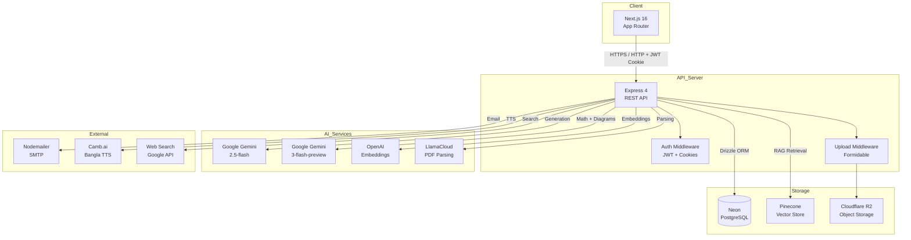
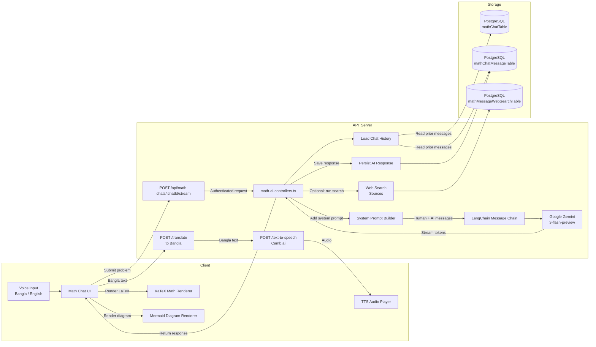

<div align="center">

# 🎓 CourseWise
### AI-Powered Personalized Study Assistant

*A research prototype exploring AI-enhanced educational tools for Bangladeshi students*

<br/>

[](https://nextjs.org/)
[](https://react.dev/)
[](https://www.typescriptlang.org/)
[](https://expressjs.com/)
[](https://neon.tech/)
[](https://js.langchain.com/)
[](https://openai.com/)
[](https://gemini.google.com/)
[](https://docs.llamaindex.ai/)

</div>

---

## 📖 Description

**CourseWise** is a full-stack, AI-powered learning platform prototype built as part of a research initiative focused on **designing intelligent, AI-assisted educational tools for Bangladeshi university students**. It explores how large language models, retrieval-augmented generation, and adaptive learning workflows can be combined into a single student-facing product.

The platform lets students organise courses, upload study materials, chat with a context-aware AI tutor, solve math problems with step-by-step guidance, analyse academic papers, take AI-generated exams, and follow personalised study paths — all within a bilingual (Bangla + English) dashboard.

> 🔬 **Research Context:** AI powered educational tool for Bangladeshi university student.

---

## ✨ Features

### 📚 Course & Content Management
- Create and organise courses into ordered topics
- Upload study materials (PDFs, documents) per topic or per course
- Files stored in **Cloudflare R2** via AWS SDK v3
- Materials are parsed by **LlamaCloud** and chunked into a **Pinecone** vector store for RAG

### 🤖 AI Text Assistant (RAG Chat)
- Per-course chat that answers questions grounded in uploaded materials
- Uses **OpenAI `text-embedding-3-large`** for retrieval and **Google Gemini 2.5-flash** for generation
- Cites relevant material names and source chunks automatically
- Full chat history persisted in PostgreSQL

### ➗ Math Assistant
- Powered by **Google Gemini 3-flash-preview** via LangChain
- Structured step-by-step solutions with LaTeX formatting rendered by **KaTeX**
- Auto-generates **Mermaid** diagrams when visualisation is requested
- Integrated web search for supplementary references; sources persisted with each message
- **Bangla translation** and **Bangla text-to-speech** via **Camb.ai**

### 🔬 Research Assistant
- Upload academic PDF papers; parsed via **LlamaCloud** and embedded with **OpenAI**
- Vectors stored in **Pinecone**; queries use semantic RAG with cited source passages
- Separate research chat history per user, persisted in PostgreSQL

### 📝 Exam Engine
- **Exam Patterns** — configure question-type distribution (MCQ, short-answer) and difficulty levels
- **Generated Exams** — AI generates complete exams from course materials matching a chosen pattern
- **Exam Sessions** — timed, interactive exam-taking interface with live answer tracking
- **Exam Results** — scored results with per-question feedback and full history per user

### 🗺️ Personalised Study Paths
- AI generates structured study plans from course topics and uploaded materials
- Output includes prioritised tasks (high/medium/low), time estimates, due dates, and strategic insights

### 📊 Performance Analytics
- Topic-level accuracy breakdown with bar charts (Recharts)
- Quiz history trend tracking
- AI-driven recommendations highlighting weak areas and suggesting revision actions

### 🎙️ Bilingual Support
- Bangla and English language support across the assistant interface
- Bangla text-to-speech via Camb.ai
- Voice input and language toggle scaffolding

### 🌙 Other
- Dark / light mode via CSS variables and `next-themes`
- PYQ (Previous Year Questions) analysis view
- Book & material library browser
- Profile and security settings (password, email, profile picture)
- Password reset via email (Nodemailer)

---

## ⚡ Quick Start

### Prerequisites

- **Node.js** 20+
- **pnpm** for the frontend, **npm** for the backend
- A **Neon PostgreSQL** database connection string
- Accounts / API keys for Google Gemini, OpenAI, Pinecone, LlamaCloud, Cloudflare R2, and Camb.ai (optional for TTS)

### Installation

```bash
# Frontend
cd client && pnpm install

# Backend
cd server && npm install
```

### Environment Variables

Copy `server/.env.example` to `server/.env` and populate:

| Variable | Purpose |
|:---|:---|
| `PORT` | API server port (e.g. `8000`) |
| `DATABASE_URL` | Neon PostgreSQL connection string |
| `JWT_SECRET` | Token signing secret |
| `GEMINI_API_KEY` | Google Gemini (chat, math, exam, study path generation) |
| `OPENAI_API_KEY` | OpenAI embeddings and LLM fallback |
| `PINECONE_API_KEY` | Pinecone vector store API key |
| `PINECONE_INDEX` | Pinecone index name |
| `LLAMA_CLOUD_API_KEY` | LlamaCloud PDF parsing |
| `ACCESS_KEY_ID` | R2 / S3 access key |
| `SECRET_ACCESS_KEY` | R2 / S3 secret key |
| `ENDPOINT_URL` | R2 / S3 endpoint URL |
| `BUCKET_NAME` | R2 / S3 bucket name |
| `PUBLIC_ACCESS_URL` | Public URL for uploaded files |
| `CAMB_API_KEY` | Camb.ai Bangla text-to-speech |
| `EMAIL_USER` | SMTP username |
| `EMAIL_PASS` | SMTP password |

For the frontend, set `NEXT_PUBLIC_BACKEND_BASE_URL` in `client/.env` (default: `http://localhost:8000`).

### Run

```bash
# Backend  → http://localhost:${PORT}
cd server && npm run dev

# Frontend → http://localhost:3000
cd client && pnpm dev
```

### Database

```bash
cd server
npm run db:generate   # generate Drizzle migrations
npm run db:migrate    # apply migrations
npm run db:push       # push schema changes (development)
npm run db:studio     # open Drizzle Studio
```

> Note: The `db:seed` script is referenced in `package.json` but no seed file currently exists in `src/db/seed`.

---

## 🛠️ Tech Stack

### Frontend (`client/`)

| Concern | Library / Version |
|:---|:---|
| Framework | Next.js 16.1.3 (App Router) + React 19.2.3 |
| Language | TypeScript 5 (strict) |
| Styling | Tailwind CSS 4 + Radix UI primitives |
| Components | shadcn/ui pattern (`components/ui/`) |
| State | Zustand 5 (per-domain stores: auth, courses, chat, math, etc.) |
| Forms | React Hook Form 7 + Zod 4 |
| HTTP | Axios with auth interceptors |
| Math Rendering | KaTeX + `rehype-katex` + `remark-math` |
| Diagrams | Mermaid 11 |
| Markdown | `react-markdown` + `remark-gfm` |
| Charts | Recharts 2.15.4 |
| UI Utilities | `class-variance-authority`, `tailwind-merge`, `lucide-react`, `sonner`, `vaul` |

### Backend (`server/`)

| Concern | Library / Version |
|:---|:---|
| Runtime | Node.js 20+, TypeScript 5.7.3, tsx |
| Framework | Express 4.21.2 |
| Database | Neon PostgreSQL + Drizzle ORM 0.39.3 + Drizzle Kit 0.31.9 |
| Auth | JWT (`jsonwebtoken`) + HTTP-only cookies + `bcryptjs` |
| Request Parsing | `express.json`, `express.urlencoded`, `formidable`, `cookie-parser` |
| Logging | Morgan |
| AI — Chat & Math | Google Gemini (`gemini-2.5-flash`, `gemini-3-flash-preview`) via `@langchain/google-genai` |
| AI — Embeddings | OpenAI `text-embedding-3-large` via `@langchain/openai` |
| AI — PDF Parsing | LlamaCloud (`@llamaindex/llama-cloud`) |
| Vector Store | Pinecone via `@langchain/pinecone` and `@pinecone-database/pinecone` |
| File Storage | AWS SDK v3 `@aws-sdk/client-s3` (Cloudflare R2 endpoint) |
| Bangla TTS | Camb.ai (`@camb-ai/sdk`) |
| Email | Nodemailer 8.0.1 |
| PDF Generation | PDFKit 0.17.2 |
| Utilities | `nanoid`, `uuid`, `axios` |

> Socket.io 4 is installed as a dependency but is not yet wired into the running Express server.

---

## 🏗️ System Architecture



### Data Flow Summary

1. **User** → Next.js frontend authenticates with the Express API using JWT in HTTP-only cookies.
2. **Course materials** are uploaded via `formidable`, stored in R2, and parsed by LlamaCloud.
3. **Chunks** are embedded with OpenAI and indexed in Pinecone for RAG retrieval.
4. **AI assistants** (chat, math, research) generate responses with Google Gemini and optionally cite retrieved materials or web sources.
5. **Exam engine** builds question patterns, generates timed exams, tracks sessions, and stores results.
6. **Study paths** and analytics are computed from course content and exam/quiz history, persisted in PostgreSQL.
7. **Bangla TTS** is produced through Camb.ai for the math assistant voice features.

### ➗ Math Chatbot Architecture



#### Math Chatbot Request Flow

1. **Student submits a math problem** through the math chat UI in the Next.js frontend (supports typed or voice input in Bangla/English).
2. **Request reaches the Express server** at `POST /api/math-chats/:chatId/stream` after passing the `verifyJWT` auth middleware.
3. **Controller loads context** from `mathChatTable` and `mathChatMessageTable` in PostgreSQL to build the conversation history.
4. **LangChain prompt is assembled** with a system prompt that enforces:
   - Step-by-step solutions
   - LaTeX-style math notation
   - Mermaid diagram generation when visualisation is requested
   - Encouraging, educational tone
5. **Google Gemini 3-flash-preview** generates the response, streamed back to the client for a low-latency experience.
6. **Client-side rendering**:
   - `KaTeX` renders inline and block math equations.
   - `Mermaid` renders diagrams from fenced `mermaid` code blocks.
7. **Persistence** — the streamed response is saved back to `mathChatMessageTable`.
8. **Optional web search** — the controller can fetch supplementary web sources via the Google Search API and store them in `mathMessageWebSearchTable`.
9. **Bilingual features** — Bangla responses can be produced and converted to speech through the `POST /translate` and `POST /text-to-speech` endpoints using **Camb.ai**, then played in the browser audio player.

---

<div align="center">

*Built with ❤️ for Bangladeshi university students — CourseWise Research Prototype*

</div>
