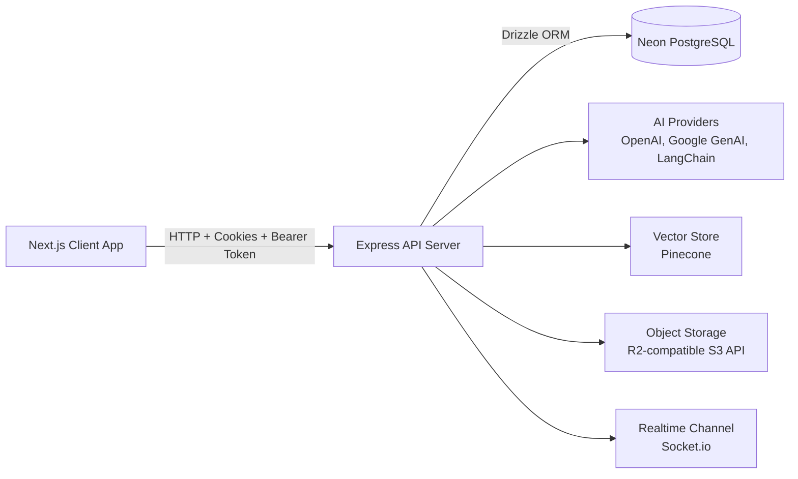

# CourseWise Assistant

### Learn Smarter with AI-Powered Course Management

An end-to-end learning platform that combines course operations, AI study assistance, exam systems, and personalized study workflows.


---

## What Is CourseWise?

CourseWise is a full-stack monorepo application built for students and educators who want an AI-enhanced study ecosystem.

It helps you:

- 📚 Manage courses, topics, and learning materials
- 🤖 Use AI assistants for math, text, and research support
- 📝 Generate and track exam patterns, sessions, and results
- 🧭 Build personalized study paths
- 📈 Monitor learning analytics and performance trends

---

## Monorepo Structure

```text
p-2-all-prototypes/
├── client/         # Next.js frontend (App Router)
├── server/         # Express + TypeScript backend API
├── AGENTS.md       # Team coding standards and architecture guidance
└── README.md
```

---

## System Architecture



---

## Tech Stack

### Frontend

- ⚡ Next.js 16 (App Router)
- ⚛️ React 19
- 🧩 TypeScript 5
- 🎨 Tailwind CSS 4 + Radix UI
- 🗃️ Zustand state management
- ✅ React Hook Form + Zod validation
- 🌐 Axios API client with auth interceptors
- 📊 Recharts + Mermaid + KaTeX/Markdown rendering

### Backend

- 🚀 Express 4 + TypeScript
- 🗄️ PostgreSQL (Neon) + Drizzle ORM/Drizzle Kit
- 🔐 JWT auth + cookies + bcryptjs
- 🔌 Socket.io for realtime features
- ☁️ AWS SDK (R2-compatible object storage)
- 🧠 LangChain + OpenAI + Google GenAI + Pinecone + Llama Cloud

---

## Core Backend API Domains

- auth
- courses
- topics
- materials
- chats and math-chats
- research-papers
- exam-patterns
- generated-exams
- exam-sessions
- exam-results
- study-paths

---

## Quick Start

### 1. Prerequisites

- Node.js 20+
- pnpm (frontend) and npm (backend)
- PostgreSQL connection string (Neon recommended)

### 2. Install Dependencies

Frontend:

```bash
cd client
pnpm install
```

Backend:

```bash
cd server
npm install
```

### 3. Configure Environment Variables

Backend:

- Copy `server/.env.example` to `server/.env`
- Fill database, auth, email, storage, and AI provider values

Frontend:

- Set `NEXT_PUBLIC_BACKEND_BASE_URL`
- Default is `http://localhost:8000`

### 4. Run Development Servers

Backend:

```bash
cd server
npm run dev
```

Frontend:

```bash
cd client
pnpm dev
```

Default URLs:

- Frontend: http://localhost:3000
- Backend: http://localhost:8000

---

## Database Commands

Run from `server/`:

```bash
npm run db:generate
npm run db:migrate
npm run db:studio
```

---

## Engineering Standards

- Code quality and architectural guidance are defined in `AGENTS.md`
- Strict TypeScript-first development across frontend and backend
- Domain-driven modularization for routes, components, and services

---

## Project Status

✅ Domain-structured Next.js frontend
✅ Multi-module Express API backend
✅ Drizzle migration tooling in place
✅ AI integrations for personalized study workflows

---

## Roadmap Ideas

- Add one-command root scripts for local development
- Add test coverage and CI/CD pipeline documentation
- Add deployment guide and environment matrix
- Add architecture images in a dedicated docs directory
