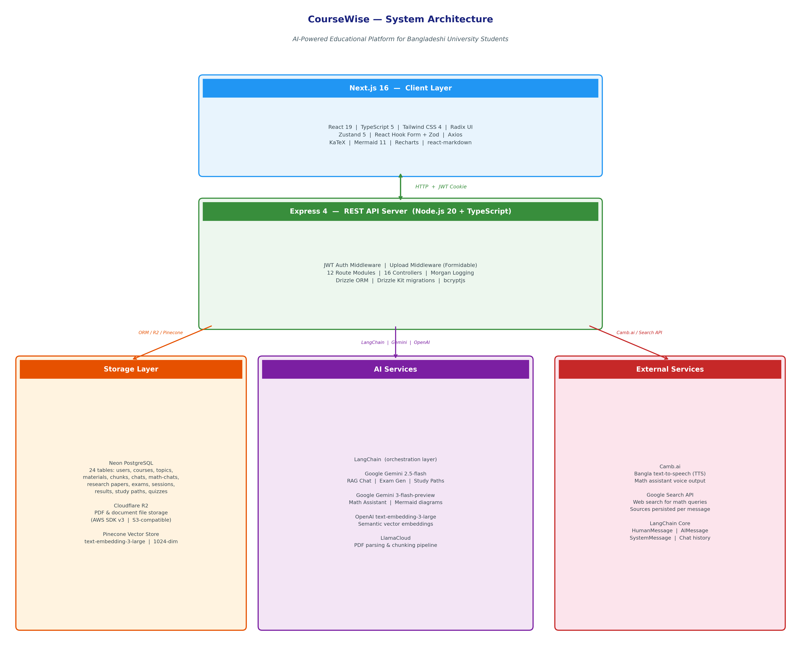
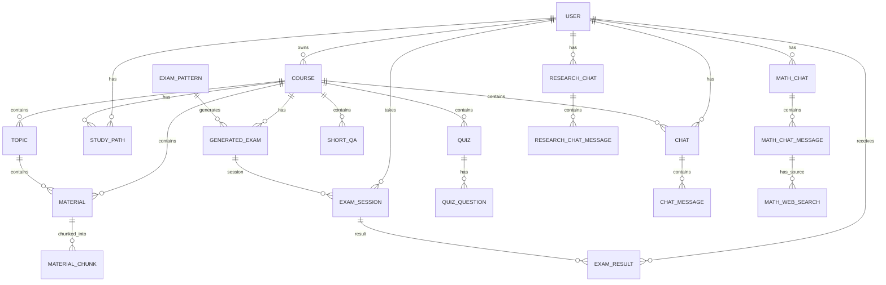

# CourseWise — System Design & Architecture

> **Research Prototype:** AI-powered educational platform for Bangladeshi university students.

---

## 1. Overview

CourseWise is a full-stack, AI-assisted learning platform. It is designed as a research prototype to explore how modern LLMs, retrieval-augmented generation (RAG), and adaptive learning workflows can be packaged into a single student-facing product. The system lets students organise courses, upload materials, chat with context-aware AI tutors, solve math problems, analyse research papers, attempt AI-generated exams, and receive personalised study recommendations.

This document describes the overall system design, the responsibilities of each component, the data model, the API surface, and the request flows for the major features.

---

## 2. Design Goals

| Goal | Description |
|------|-------------|
| **Modularity** | Clear separation between client, server, storage, AI, and external services. |
| **Scalability** | Stateless API server; horizontal scaling is possible by adding more Node.js instances behind a load balancer. |
| **Type Safety** | Strict TypeScript on both frontend and backend. |
| **Security** | JWT in HTTP-only cookies, bcrypt password hashing, CORS restricted to known origins, environment-based secrets. |
| **RAG-First** | Course-specific answers are grounded in uploaded materials via vector search. |
| **Bilingual UX** | Bangla and English support with Bangla text-to-speech via Camb.ai. |
| **Extensibility** | Route-based modular controllers and per-domain Zustand stores make it easy to add new features. |

---

## 3. High-Level Architecture



The system is divided into five logical layers:

1. **Client Layer** — Next.js 16 React frontend.
2. **API Server Layer** — Express 4 REST API with middleware and controllers.
3. **Storage Layer** — Neon PostgreSQL, Cloudflare R2, and Pinecone.
4. **AI Services Layer** — LangChain, Google Gemini, OpenAI embeddings, and LlamaCloud.
5. **External Services Layer** — Camb.ai, Google Search API, and LangChain Core utilities.

---

## 4. Component Architecture

### 4.1 Client Layer (`client/`)

| Concern | Technology |
|---------|------------|
| Framework | Next.js 16 (App Router) + React 19 |
| Language | TypeScript 5 with strict mode |
| Styling | Tailwind CSS 4 + Radix UI primitives |
| Components | shadcn/ui pattern in `components/ui/` |
| State | Zustand 5, one store per domain (`auth`, `courses`, `chat`, `math`, etc.) |
| Forms | React Hook Form + Zod 4 |
| HTTP | Axios with request/response interceptors |
| Math Rendering | KaTeX + `rehype-katex` + `remark-math` |
| Diagrams | Mermaid 11 |
| Charts | Recharts 2 |
| UI Utilities | `class-variance-authority`, `tailwind-merge`, `lucide-react`, `sonner`, `vaul` |

The frontend is built primarily as Server Components. Client Components are used as leaf nodes for interactive features such as chat input, form submissions, and audio playback. API calls are routed through service functions in `services/`.

---

### 4.2 API Server Layer (`server/src/`)

| Concern | Technology |
|---------|------------|
| Runtime | Node.js 20+, TypeScript 5.7.3, `tsx` for hot reload |
| Framework | Express 4.21.2 |
| Body Parsing | `express.json`, `express.urlencoded`, `formidable` |
| Cookies | `cookie-parser` |
| Logging | `morgan` (dev format) |
| CORS | Restricted to `localhost:3000`, `localhost:3001`, and two DevTunnel URLs |

**Entry point:** `server/src/index.ts`

Mounted routers (`/api/*`):

- `auth` — signup, login, logout, profile, password reset
- `courses` — course CRUD
- `topics` — topics inside a course
- `materials` — file upload, parsing, chunking
- `chats` — course-based RAG chat
- `math-chats` — math assistant, translation, TTS, web search
- `research-papers` — research paper upload and RAG chat
- `exam-patterns` — question-type distribution templates
- `generated-exams` — AI-generated exams from a pattern
- `exam-sessions` — timed exam taking and answer tracking
- `exam-results` — scoring and result history
- `study-paths` — personalised study plans

---

### 4.3 Storage Layer

| Store | Service | Purpose |
|-------|---------|---------|
| **Relational Database** | Neon PostgreSQL | Primary transactional data: users, courses, topics, materials, chats, exams, results, study paths. |
| **Object Storage** | Cloudflare R2 | Raw uploaded files (PDFs, documents) via AWS SDK v3. |
| **Vector Store** | Pinecone | Semantic embeddings of material chunks and research paper chunks for RAG. |

**Database access:** Drizzle ORM 0.39.3 with Drizzle Kit 0.31.9 for migrations.

---

### 4.4 AI Services Layer

| Service | Role |
|---------|------|
| **LangChain** | Orchestrates prompts, message chains, vector retrievers, and streaming. |
| **Google Gemini 2.5-flash** | RAG chat, exam generation, study path generation, research chat. |
| **Google Gemini 3-flash-preview** | Math assistant with step-by-step solutions and Mermaid diagrams. |
| **OpenAI `text-embedding-3-large`** | Generates 1024-dim embeddings for RAG chunks. |
| **LlamaCloud** | Parses PDFs into text chunks for indexing. |

---

### 4.5 External Services Layer

| Service | Role |
|---------|------|
| **Camb.ai** | Bangla text-to-speech for the math assistant. |
| **Google Search API** | Supplementary web search for math queries; sources persisted per message. |
| **LangChain Core** | Message abstractions (`HumanMessage`, `AIMessage`, `SystemMessage`) and chat history helpers. |

---

## 5. Database Design

### 5.1 Schema Tables

The schema is split into domain-specific files under `server/src/db/schema/`:

| Table | Domain | Purpose |
|-------|--------|---------|
| `userTable` | Auth | User accounts, password hashes, profiles, roles. |
| `courseTable` | Courses | Courses created by users. |
| `topicTable` | Courses | Ordered topics within a course. |
| `materialTable` | Materials | Uploaded files metadata (R2 key, MIME type, topic/course link). |
| `materialChunksTable` | Materials | Parsed text chunks from a material, ready for embedding. |
| `chatTable` | Chat | Per-course chat sessions. |
| `chatMessageTable` | Chat | Messages in a course chat. |
| `mathChatTable` | Math | Math chat sessions per user. |
| `mathChatMessageTable` | Math | Messages in a math chat. |
| `mathMessageWebSearchTable` | Math | Web search results linked to a math message. |
| `researchChatTable` | Research | Research chat sessions per user. |
| `researchChatMessageTable` | Research | Messages in a research chat. |
| `researchPaperTable` | Research | Uploaded academic papers metadata. |
| `researchPaperChunksTable` | Research | Parsed text chunks from a research paper. |
| `quizTable` | Quizzes | Quizzes associated with a course. |
| `quizQuestionTable` | Quizzes | Individual quiz questions. |
| `shortQATable` | Quizzes | Short Q&A entries for a course. |
| `examPatternTable` | Exams | Reusable exam templates (MCQ/short-answer mix and difficulty). |
| `generatedExamTable` | Exams | AI-generated exams produced from a pattern and course. |
| `examSessionTable` | Exams | A user's attempt at a generated exam. |
| `examResultTable` | Exams | Scored results for an exam session. |
| `studyPathTable` | Study Path | Personalised study plans for a course/user. |

### 5.2 Key Relations



---

## 6. API Design

### 6.1 Route Modules

| Base Path | Router File | Main Controller | Responsibility |
|-----------|-------------|-----------------|----------------|
| `/api/auth` | `auth-route.ts` | `auth-controllers.ts` | Signup, login, logout, JWT profile, password reset. |
| `/api/courses` | `course-route.ts` | `course-controllers.ts` | Course CRUD. |
| `/api/topics` | `topic-route.ts` | `topic-controllers.ts` | Topic CRUD inside a course. |
| `/api/materials` | `material-route.ts` | `material-controllers.ts`, `material-parsing-controller.ts` | Upload, list, delete materials; parse and chunk. |
| `/api/chats` | `chat-route.ts` | `chat-controllers.ts`, `chat-ai-controller.ts` | Course chat and RAG streaming. |
| `/api/math-chats` | `math-chat-route.ts` | `math-ai-controllers.ts` | Math chat, streaming, translation, TTS, web search. |
| `/api/research-papers` | `research-paper-route.ts` | `research-paper-controller.ts`, `research-chat-controller.ts` | Paper upload, research chat, RAG. |
| `/api/exam-patterns` | `exam-pattern-route.ts` | `exam-pattern-controllers.ts` | Exam pattern templates. |
| `/api/generated-exams` | `generated-exam-route.ts` | `generated-exam-controllers.ts` | AI-generated exams. |
| `/api/exam-sessions` | `exam-session-route.ts` | `exam-session-controllers.ts` | Timed exam attempts. |
| `/api/exam-results` | `exam-result-route.ts` | `exam-result-controllers.ts` | Scoring and history. |
| `/api/study-paths` | `study-path-route.ts` | `study-path-controllers.ts` | Personalised study plans. |

### 6.2 Authentication Pattern

- JWT is issued at login and stored in an HTTP-only cookie.
- The `verifyJWT` middleware extracts the token from the cookie or `Authorization` header, validates it with `process.env.JWT_SECRET`, and attaches the user record to the request.
- All feature routes except `/api/auth` use `verifyJWT`.

### 6.3 Representative Endpoints

**Course Chat (RAG):**
- `POST /api/chats/:chatId/messages` — add a human message.
- `POST /api/chats/:chatId/ai-response` — stream an AI response using RAG.

**Math Assistant:**
- `POST /api/math-chats/:chatId/stream` — stream a step-by-step math solution.
- `POST /api/math-chats/translate` — translate content to Bangla.
- `POST /api/math-chats/text-to-speech` — convert Bangla text to speech.
- `POST /api/math-chats/:chatId/messages/:messageId/web-search` — run and persist web search.

**Research Assistant:**
- `POST /api/research-papers` — upload a paper.
- `POST /api/research-papers/:paperId/chat` — RAG chat over the paper.

**Exam Engine:**
- `POST /api/exam-patterns` — create an exam pattern.
- `POST /api/generated-exams` — generate an exam from a pattern and course.
- `POST /api/exam-sessions` — start an exam session.
- `POST /api/exam-results` — submit and score a session.

---

## 7. Request Flows

### 7.1 RAG Chat Flow (Course AI Tutor)

1. User sends a question in a course chat from the Next.js frontend.
2. `POST /api/chats/:chatId/messages` stores the human message in `chatMessageTable`.
3. `POST /api/chats/:chatId/ai-response` triggers the `chat-ai-controller.ts`.
4. The controller loads the chat history, builds a system prompt, and retrieves top-k relevant chunks from Pinecone using OpenAI embeddings.
5. LangChain sends the context + history + question to `gemini-2.5-flash`.
6. The response is streamed to the client and persisted in `chatMessageTable`.
7. The UI renders markdown, citations, and any Mermaid diagrams.

### 7.2 Math Assistant Flow

1. User submits a math problem (typed or voice) in Bangla or English.
2. `POST /api/math-chats/:chatId/stream` passes through `verifyJWT` and enters `math-ai-controllers.ts`.
3. The controller loads prior messages from `mathChatTable` and `mathChatMessageTable`.
4. A system prompt enforces LaTeX notation, step-by-step reasoning, and optional Mermaid diagrams.
5. LangChain streams tokens from `gemini-3-flash-preview` back to the client.
6. The client renders math with KaTeX and diagrams with Mermaid.
7. The full response is saved to `mathChatMessageTable`.
8. Optional: web search fetches sources via Google Search API and stores them in `mathMessageWebSearchTable`.
9. Optional: Bangla translation and TTS via Camb.ai produce audio for the answer.

### 7.3 Exam Generation & Taking Flow

1. Instructor or student creates an `examPattern` with MCQ/short-answer distribution and difficulty.
2. `POST /api/generated-exams` reads the pattern and course material chunks, then asks Gemini to generate a complete exam.
3. The generated exam is stored in `generatedExamTable`.
4. `POST /api/exam-sessions` creates a timed `examSessionTable` row linked to the user and exam.
5. The frontend presents questions and tracks answers in real time.
6. `POST /api/exam-results` finalises the session, scores answers, and writes to `examResultTable`.

### 7.4 Research Assistant Flow

1. User uploads a PDF paper.
2. `POST /api/research-papers` stores the file in R2 and metadata in `researchPaperTable`.
3. LlamaCloud parses the PDF into chunks; `researchPaperChunksTable` stores the chunks.
4. OpenAI embeddings are written to Pinecone.
5. `POST /api/research-papers/:paperId/chat` retrieves relevant chunks and streams a Gemini response.
6. Chat history is stored in `researchChatTable` and `researchChatMessageTable`.

### 7.5 Study Path Generation Flow

1. User requests a study path for a course.
2. `POST /api/study-paths` sends course topics, materials, and any exam results to Gemini.
3. Gemini returns prioritised tasks, time estimates, due dates, and strategic insights.
4. The plan is saved in `studyPathTable` and displayed in the dashboard.

---

## 8. Security Design

| Layer | Mechanism |
|-------|-----------|
| **Transport** | HTTPS in production; HTTP allowed only for local development. |
| **Authentication** | JWT signed with `JWT_SECRET` and stored in HTTP-only cookies. |
| **Authorisation** | Controllers verify the authenticated user owns the requested course/chat/exam. |
| **Passwords** | `bcryptjs` with a cost factor of 10 or more. |
| **File Uploads** | `formidable` parses multipart data; files are uploaded to R2, not the server disk. |
| **CORS** | Whitelist-based, credentials enabled. |
| **Secrets** | All API keys and credentials live in `.env` files ignored by Git. |
| **Input Validation** | Zod schemas on both frontend and backend (backend uses Zod in controllers). |

---

## 9. Deployment & Environment

### 9.1 Required Environment Variables

| Variable | Purpose |
|----------|---------|
| `PORT` | API server port. |
| `DATABASE_URL` | Neon PostgreSQL connection string. |
| `JWT_SECRET` | JWT signing secret. |
| `GEMINI_API_KEY` | Google Gemini API access. |
| `OPENAI_API_KEY` | OpenAI embeddings and fallback LLM. |
| `PINECONE_API_KEY` / `PINECONE_INDEX` | Vector store access. |
| `LLAMA_CLOUD_API_KEY` | PDF parsing. |
| `ACCESS_KEY_ID` / `SECRET_ACCESS_KEY` / `ENDPOINT_URL` / `BUCKET_NAME` / `PUBLIC_ACCESS_URL` | Cloudflare R2 access. |
| `CAMB_API_KEY` | Bangla TTS. |
| `EMAIL_USER` / `EMAIL_PASS` | SMTP for password reset (optional). |

### 9.2 Run Commands

```bash
# Backend
cd server
npm install
npm run db:migrate
npm run dev

# Frontend
cd client
pnpm install
pnpm dev
```

### 9.3 Frontend Origin

The frontend expects the backend at `http://localhost:8000` by default, configurable via `NEXT_PUBLIC_BACKEND_BASE_URL` in `client/.env`.

---

## 10. Future Considerations

| Area | Possible Enhancement |
|------|----------------------|
| **Real-time** | Wire up Socket.io 4 (already installed) for live chat or exam proctoring. |
| **Caching** | Add Redis for session caching and frequently accessed course data. |
| **Rate Limiting** | Apply per-user rate limits on AI endpoints to control cost. |
| **Testing** | Add Vitest/Jest for frontend components and Supertest for API integration tests. |
| **CI/CD** | GitHub Actions pipeline for type checks, lint, and deployment. |
| **Observability** | Structured logging with Pino or Winston and tracing for AI calls. |
| **Multi-tenancy** | Role-based access control for instructors vs. students. |

---

*CourseWise System Design — generated from a full scan of the project source.*
